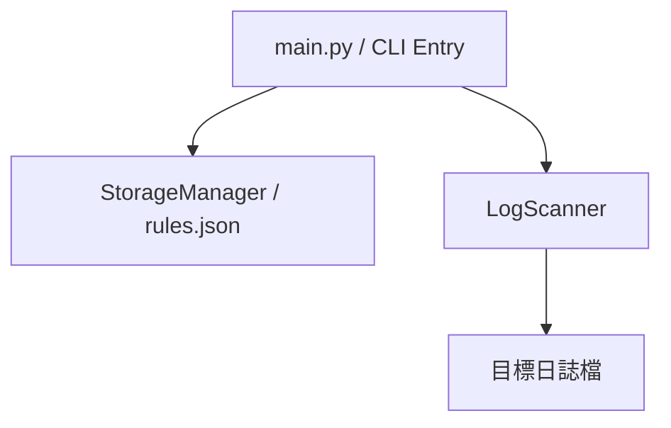

## 專案概覽
- **程式名稱**：LogAlert CLI
- **版本**：v1.0
- **一句話描述**：一個輕量級的本地日誌監控工具，能根據自定義規則過濾關鍵字。
- **目標使用者**：系統管理員、開發者，或需要監控特定文字變動的使用者。
- **核心價值**：透過簡單的 CLI 指令，自動化繁瑣的日誌檢查工作，提升異常偵測效率。

## 指令規格

### `<command> [options]`

| 指令 | 參數 | 說明 | 範例 |
|---|---|---|---|
| `rule_add` | `--keyword TEXT`   `--level TEXT` | 新增要攔截的關鍵字，並標註警報等級（如 INFO, WARN, ERROR） | ` python main.py rule_add --keyword "Exception" --level "ERROR"` |
| `rule_list` | 無 | 列出目前所有設定的攔截規則 | `python main.py rule_list` |
| `rule_delete` | `--id INT` | 刪除指定的攔截規則 | `python main.py rule_delete --id 1` |
| `scan` | `--file PATH`   `--output PATH` | 掃描指定的本地檔案，印出包含關鍵字的行數與內容；加上 `--output` 可將結果依 keyword 分區輸出至檔案 | `python main.py scan --file "./sample.log" --output report.txt` |
| `rule_hits` | `--id INT`   `--file PATH` | 列出指定規則在目標 log 檔中所有匹配到的行 | `python main.py rule_hits --id 1 --file "./sample.log"` |
| `monitor` |`--file PATH`   `--interval FLOAT` |進入持續監控模式，每隔指定秒數自動掃描新的檔案內容。|`python main.py monitor --file "./sample.log" --interval 5`|

## 資料模型

### Rule (過濾規則)
| 欄位 | 型別 | 說明 | 必填 |
|---|---|---|---|
| id | int | 規則的唯一識別碼，自動遞增 | ✅ |
| keyword | str | 要攔截的關鍵字（v1.0 採完全字串比對） | ✅ |
| level | str | 警報等級 (INFO, WARN, ERROR) | ✅ |
| created_at | str | 規則建立的時間戳記 | ✅ |

## 模組架構（Module Design）

## 錯誤處理規格（Error Handling）

| 情境 | 預期行為 | 退出碼 |
|---|---|---|
| 讀不到規則檔 | 自動建立新的空白 rules.json | 0 |
| 掃描時找不到目標檔案 | 輸出 Error: File not found | 1 |
| 指令參數缺失 | 輸出用法提示 (Usage Hint) | 2 |
| `rule_hits` 指定的 Rule ID 不存在 | 輸出 `[Error] Rule ID X not found.` | 1 |

## 測試案例

| # | 輸入指令 | 預期輸出 | 通過條件 |
|---|---|---|---|
| 1 | `python main.py rule_add --keyword "Exception" --level "ERROR"` | `[Success] Rule added: ID=1, Keyword=Exception` | stdout 包含 Success 與 Exception |
| 2 | ` python main.py rule_list` | 顯示包含 ID 1 與 Exception 的表格 | 退出碼 0，stdout 包含表格格式 |
| 3 | `python main.py scan --file "./sample.log"` | `[ALERT-ERROR] Line 3: [2026-03-14 10:10:00] Exception: Database connection timeout.` | stdout 包含 ALERT 與找到的日誌行 |
| 4 | `python main.py rule_delete --id 1` | `[Success] Rule ID 1 deleted.` | stdout 包含 deleted |
| 5 | `python main.py scan --file "./missing.log"` | `[Error] File not found: ./missing.log` | 退出碼 1 |
| 6 | `python main.py monitor --file "./sample.log"` | `[Monitor] Watching: ./sample.log  (Press Ctrl+C to stop)` | stdout 包含 Watching 與檔案路徑 |
| 7 | `python main.py rule_hits --id 1 --file "./sample.log"` | `[Rule #1] Keyword='Exception' \| Level=ERROR` 並列出匹配行與總計 | stdout 包含 Rule #1 與 match(es) found |
| 8 | `python main.py scan --file "./sample.log" --output report.txt` | stdout 包含 `[Info] Report saved to 'report.txt'`，report.txt 依 keyword 分區 | 退出碼 0，report.txt 存在且包含 `[Keyword:` 區塊 |
