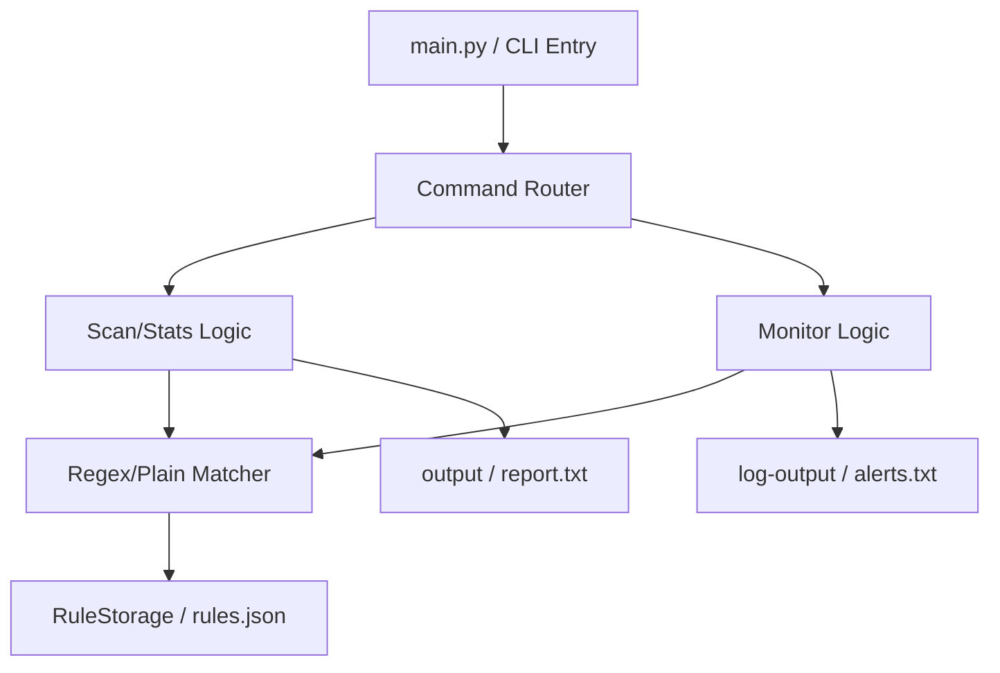
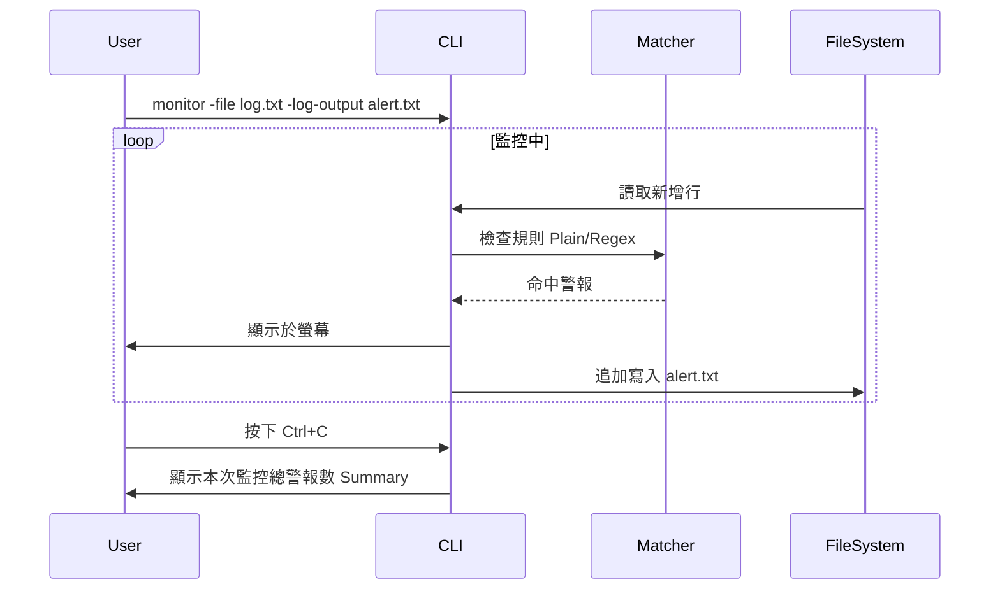

# 作業 2：規格 SDD v2.0 優化實作

## 1. 專案概覽

- **程式名稱**：LogAlert CLI
- **版本**：v2.0
- **一句話描述**：支援正則表達式、警報持久化與等級過濾的進階日誌監控工具。
- **目標使用者**：需要處理複雜日誌格式、追蹤歷史警報並進行命中統計的系統管理員與開發者。
- **核心價值**：透過 SDD 迭代，將原本的字串比對進化為強大的規則引擎，並確保大數據量下的過濾效率與資料保存。

## 2. 指令規格

```
python main.py <command> [options]
```

| 指令 | 參數 | 說明 | 範例 |
|------|------|------|------|
| `rule_add` | `--keyword TEXT`<br>`--level TEXT`<br>`--mode [plain\|regex]` | 新增關鍵字，可選擇一般比對或正則比對（預設為 plain）。 | `python main.py rule_add --keyword "Connect\w+" --mode regex` |
| `rule_list` | 無 | 列出所有規則，並新增一欄顯示其比對模式（Mode）。 | `python main.py rule_list` |
| `scan` | `--file PATH`<br>`--output PATH`<br>`--level TEXT` | 執行掃描。新增 `--level` 可僅輸出特定等級的警報（如 ERROR）。 | `python main.py scan --file "./sample.log" --level ERROR` |
| `monitor` | `--file PATH`<br>`--interval FLOAT`<br>`--log-output PATH` | 進入監控模式。新增 `--log-output` 可將警報同步存入檔案；結束時顯示摘要統計。 | `python main.py monitor --file "./sample.log" --log-output alerts.txt` |
| `rule_stats` | `--file PATH` | (NEW) 快速掌握各條規則在日誌檔中的命中次數統計。 | `python main.py rule_stats --file "./sample.log"` |
| `rule_delete` | `--id INT` | 刪除指定 ID 的規則。 | `python main.py rule_delete --id 1` |
| `rule_hits` | `--id INT`<br>`--file PATH` | 列出指定規則在目標日誌檔中所有匹配的行，內部邏輯自動套用 plain 或 regex 比對模式。 | `python main.py rule_hits --id 1 --file "./sample.log"` |

## 3. 資料模型

### Rule (過濾規則)

| 欄位 | 型別 | 說明 | 必填 |
|------|------|------|:----:|
| `id` | `int` | 規則的唯一識別碼 | ✅ |
| `keyword` | `str` | 比對內容（字串或正則表達式） | ✅ |
| `level` | `str` | 警報等級 | ✅ |
| `mode` | `str` | (NEW) 比對模式：plain (預設) 或 regex。 | ✅ |
| `created_at` | `str` | 規則建立的時間戳記 | ✅ |

## 4. 系統架構圖 (Architecture Diagram)



## 5. 核心功能流程圖：Monitor 監控持久化



## 6. 向下相容性設計 (Backward Compatibility)

### 保留的 v1.0 介面

| v1.0 指令 | 行為 | v2.0 改動說明 | 是否相容 |
|-----------|------|--------------|:-------:|
| `rule_add` 不帶 `--mode` | 預設採 plain 模式，輸出格式保留 `Keyword=`，並新增 `Mode=` 資訊。 | ✅ 完全相容 |
| `rule_list` | 保留原有欄位（ID, Keyword, Level, Created At），並新增 `Mode` 欄位。 | ✅ 完全相容 |
| `rule_delete` | 成功/失敗訊息格式與 v1.0 相同，行為無任何改動。 | ✅ 完全相容 |
| `scan` 不帶 `--level` | 輸出所有等級的結果，與 v1.0 行為一致。 | ✅ 完全相容 |
| `monitor` 不帶 `--log-output` | 僅輸出至螢幕，並於結束時額外顯示摘要（不影響現有行為）。 | ✅ 完全相容 |

### 遷移策略 (Migration Strategy)

- **資料相容**：v2.0 程式碼使用 `dict.get('mode', 'plain')` 讀取舊資料，因此 v1.0 的 `rules.json` 無需手動遷移即可直接使用。
- **規則升級**：若舊規則需要改用正則比對，建議刪除後重新以 `rule_add --mode regex` 建立。

## 7. 錯誤處理規格

| 情境 | 預期行為 | 退出碼 |
|------|---------|:------:|
| 正則表達式語法錯誤 | 輸出 `[Error] Invalid regular expression: ...` | `1` |
| `rule_delete` 指定 ID 不存在 | 輸出 `[Error] Rule ID X not found.` | `1` |
| `scan --level` 給予不存在等級 | 輸出提示：`[Hint] No rules found for level '...'. Available levels: ...` | `0` |
| `scan` 檔案不存在 | 輸出 `[Error] File not found: {file_path}` | `1` |
| `monitor` 檔案不存在 | 輸出 `[Error] File not found: {file_path}` | `1` |
| `rule_hits` 檔案不存在 | 輸出 `[Error] File not found: {file_path}` | `1` |
| `rule_hits` 指定 ID 不存在 | 輸出 `[Error] Rule ID X not found.` | `1` |
| `rule_stats` 檔案不存在 | 輸出 `[Error] File not found: {file_path}` | `1` |
| 無規則時執行 `rule_stats` | 輸出引導提示：`[Info] No rules found. Please add a rule first.` | `0` |

## 8. 測試案例 (包含 v1.0 基準與 v2.0 新增)

| # | 輸入指令 | 預期輸出 | 通過條件 |
|:-:|---------|---------|---------|
| 1 | `python main.py rule_add --keyword "Conn\w+" --mode regex` | `[Success] Rule added: ID=X, Keyword=Conn\w+, Mode=regex` | 正則規則成功建立 |
| 2 | `python main.py scan --file "log.txt" --level ERROR` | 僅顯示 ERROR 等級的警報 | (v2 新增) 達成等級過濾 |
| 3 | `python main.py monitor --file "./sample.log" --log-output a.txt` | 結束後顯示 `[Monitor] Stopped. Total alerts detected during this session: N` | (v2 新增) 警報持久化與摘要 |
| 4 | `python main.py rule_stats --file "log.txt"` | 顯示所有規則的命中統計表 | (v2 新增) 統計數據正確 |
| 5 | (同 v1-1 至 v1-8) | (維持 v1.0 之預期行為) | 驗證向下相容性 |
